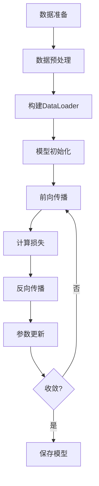

# 论文讲解 Skill

## 目标

以结构化、可追溯的方式讲解论文，帮助读者把握核心贡献、方法细节和实验结果。

报告语言跟随用户问题语言；专业术语可保留原文并附简短注释，避免误译。

## 输入获取

根据输入类型选择获取方式，优先拿到完整正文：

### 1. PDF 文件
直接读取 PDF，提取标题、作者、摘要等元数据与正文各章节。

### 2. DOI / arXiv ID
解析 DOI 或访问 `https://arxiv.org/abs/{ID}`，优先获取 PDF。

### 3. 论文链接
访问链接并提取内容，支持 arXiv、ACL Anthology、OpenReview、Semantic Scholar、出版社官网、期刊/会议系统与机构仓储。若遇登录/付费限制，说明限制并请用户提供 PDF。

### 4. 论文标题
用搜索工具查找论文并确认匹配；若出现多个候选，先请用户确认再继续。

### 5. 论文片段（摘要/段落）
基于现有片段分析，并在报告中标注"[基于部分内容分析]"，同时建议用户提供完整论文以获得更深入结论。

### 6. 多论文输入
逐篇生成报告；用户需要时追加“论文对比分析”章节。

## 论文类型识别

先判断论文类型以决定分析侧重点。判断依据为标题、摘要和引言前几段；无法确认时按实验类保守处理并说明。

| 论文类型 | 特征 | 分析侧重点 |
|----------|------|-----------|
| **实验类** | 提出新模型/方法，有定量实验 | 方法架构、实验结果、消融实验 |
| **理论类** | 以数学证明/定理为主 | 理论框架、证明思路、理论意义 |
| **综述类** | 系统梳理某一领域 | 分类体系、发展趋势、研究空白 |
| **系统/框架类** | 提出软件系统或工程框架 | 系统架构、设计决策、性能基准 |
| **人文社科类** | 定性研究为主 | 研究方法、论证逻辑、社会意义 |

## 输出结构

报告按以下结构组织。不同类型的详略可调整，但保持结构稳定，便于读者快速定位。

### 报告模板

请始终使用以下模板；标题可因论文类型略微调整，但层级与顺序保持一致：

```
# 一句话总结

# 论文基本信息

# 核心内容详解
## 1. 研究背景与问题
## 2. 方法方案
## 3. 实验/结果
## 4. 改进空间与展望

# 流程图详解

# 总结
```

### 文件命名

- 输出文件名使用论文标题。
- 多论文时使用“论文标题-1/2/3”区分。
- 标题含不合法文件名字符（/\\:*?"<>|）时，用短横线替换。

### 证据标注与不确定性

为保证结论可追溯，区分事实、推断与不确定性：

- **事实类结论**：句末标注证据来源，例如`[证据: 第4节]`、`[证据: p.12]`、`[证据: 摘要]`。
- **推断/解释**：句末标注`[推断]`，并说明依据来自哪些已知信息。
- **不确定**：无法确认时标注`[待核实]`，不要强行补全细节。

仅掌握摘要或少量段落时，在相关段落显式标注“基于部分内容分析”。

### 第一部分：一句话总结

在报告最开头，用一到两句话概括论文的核心贡献，帮助读者在深入细节前快速抓住重点。

**示例：**
> 本文提出了 Transformer 架构，完全基于注意力机制摒弃了 RNN 和 CNN，在机器翻译任务上取得了 SOTA 结果，同时训练效率大幅提升。

### 第二部分：论文基本信息

```
# 论文标题
**会议/期刊**: [会议/期刊名称] | **年份**: [发表年份]
**作者**: [作者列表]（超过5人时用"et al."简化）
**机构**: [作者所属机构]
**论文链接**: [论文URL]
```

信息不完整时标注"[待补充]"。

### 第三部分：核心内容详解

这是报告的主体部分。根据论文类型调整侧重，但保持四小节结构：

#### 1. 研究背景与问题

说明研究背景、现有方法局限、作者指出的技术挑战与问题重要性。

综述类改为“研究领域概览”，梳理发展脉络与分类体系。

理论类侧重“理论动机”，说明为何需要新的理论工具。

#### 2. 方法方案

解析核心思想、整体架构与关键技术细节，并对比现有方法。

综述类改为“分类与对比”，按作者提出的体系梳理相关工作。

理论类侧重“理论框架”，说明核心定义、定理与证明思路。

#### 3. 实验效果

说明实验设置（数据集、评价指标、baseline）、主要结果与消融分析。

综述类改为“关键发现与趋势”。

理论类改为“理论结果”，陈述主要定理及意义。

系统/框架类强调性能基准（延迟、吞吐量、可扩展性等）。

#### 4. 改进空间与展望

客观说明方法或实验的局限，并提出合理的未来方向，数量随论文实际情况调整。

### 第四部分：流程图详解

使用 Mermaid 语法绘制流程图，帮助读者理解方法或系统的流程。若关键信息不足，改为简化流程图或明确说明无法绘制，并解释原因；避免臆测训练/推理细节。

**流程图类型选择指南：**

- **实验类论文（涉及训练）**：给出训练流程图与推理流程图；系统较复杂时补充系统架构图。
- **实验类论文（不涉及训练）**：给出从输入到输出的处理流程图。
- **理论类论文**：给出证明思路流程图或理论框架关系图。
- **综述类论文**：给出研究领域分类体系图或发展时间线。
- **系统/框架类论文**：给出系统架构图与数据处理流水线图。
- **人文社科类论文**：给出研究方法流程图。

**流程图通用要求：**
- 使用 Mermaid 语法（flowchart 或 graph）。
- 每个流程图附逐步说明，解释节点含义与关键步骤。
- 复杂流程分层展示，关键节点尽量带证据标注（如`[证据: 第3节]`）。

**训练阶段流程图示例：**



### 第五部分：总结

用一小段话收束核心贡献、意义与可能影响；若为奠基性工作，可简要指出其后续影响。

## 执行流程

1. **获取论文内容**：按输入类型提取正文与元数据。
2. **识别论文类型**：依据标题、摘要与引言判定类型并说明理由。
3. **提取关键信息**：定位 Abstract、Introduction、Method、Experiments、Conclusion 等章节并记录证据位置。
4. **生成报告**：按模板输出，关键结论附证据，推断与不确定性明确标注。
5. **流程图检查**：信息不足时降级为简化图或说明无法绘制。
6. **自检**：核对结构、证据与流程图一致性，避免臆测。

## 检查清单

- [ ] 输入类型识别正确；如有多个候选论文已请求用户确认
- [ ] 论文类型判断明确，不确定时已说明并按实验类保守处理
- [ ] 报告结构完整：一句话总结、基本信息、核心内容四小节、流程图详解、总结
- [ ] 关键结论均有证据标注；推断与不确定性已明确标注
- [ ] 仅有摘要或部分内容时已标注“基于部分内容分析”，并说明信息缺失
- [ ] 流程图与文本一致；信息不足时已降级为简化图或说明无法绘制
- [ ] 未臆造实验数值、数据集或方法细节
- [ ] 输出语言与用户一致，术语保留原文并附注释
- [ ] 输出文件名使用`论文标题-analysis`并按规则处理
- [ ] 边界情况处理符合规则（超长、非学术、多论文等）

## 边界情况处理

### 信息不完整
标注"[待补充]"并继续分析可获得内容，同时在报告开头说明信息缺失。

### 链接或搜索失败
说明失败原因，并请求用户提供 PDF、arXiv ID 或更准确的标题。

### 超长论文（50页+）
优先深入分析方法与实验章节，对相关工作与附录进行概括；在报告中注明"[本文为长篇论文，部分章节为概括性分析]"。

### 只能获取摘要
基于摘要进行分析，标注"[基于摘要分析]"，并建议用户提供完整 PDF。

### 非学术论文
说明其非论文性质并询问是否继续分析。

### 多论文对比
为每篇论文生成独立报告，最后增加“论文对比分析”章节，从方法、效果、创新点与适用场景等维度对比。

## 写作原则

1. **深入而非宽泛**：宁可少覆盖一个点，也要把覆盖的点讲透。
2. **解释原因**：说明“是什么”的同时解释“为什么”，让读者理解设计动机与结果意义。
3. **证据优先**：关键结论必须可追溯，避免凭空补全。
4. **准确第一**：不确定处明确标注，避免曲解作者原意。
5. **客观评价**：改进空间保持中立，既不夸大也不贬低。
6. **结构清晰**：标题层级稳定，便于快速定位信息。
