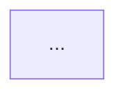

# 论文 MD 文档整理 技能

系统性地在多文件范围内整理论文笔记。本技能处理 frontmatter 元数据（标签、别名、标题）、**原文 PDF 链接的添加**，以及**文档结构标准化**，使所有论文笔记遵循统一的标准格式框架。

## 标准格式框架

所有论文笔记应遵循以下标准结构：

### Frontmatter

```yaml
---
title: "论文完整标题"
date: YYYY-MM-DD
tags:
  - paper/主题1
  - paper/主题2
aliases:
  - 简称1
  - 简称2
---
```

- `tags` 必须使用 `paper/xxx` 层级格式（如 `paper/vlm`、`paper/lora`）
- `aliases` 包含论文简称和其他常用提法
- `date` 为整理/创建日期

### 正文结构

```
**原文**: [本地](论文/论文原件/文件名.pdf) [网络](https://arxiv.org/abs/XXXX.XXXXX)

# 一句话总结

一句话概述论文核心贡献，使用 **加粗** 和 ==高亮== 标记关键术语，末尾标注 [证据: 来源]。

# 论文基本信息

| 属性       | 内容 |
|------------|------|
| **论文标题** | ... |
| **作者**    | ... |
| **机构**    | ... |
| **arXiv ID** | ... |
| **基础模型** | ... |
| **核心方法** | ... |
| **开源代码** | ... |
| **评估数据集** | ... |

> [!info] 论文定位
> 本文属于 ==领域A== 与 ==领域B== 的交叉领域，聚焦于解决...问题。

# 核心内容详解

## 1. 研究背景与问题

### 1.x 小节标题

### 1.x 小节标题

## 2. 方法方案

### 2.x ...

## 3. 实验/结果

### 3.x ...

## 4. 改进空间与展望

### 4.x ...

# 流程图详解



### 逐步说明

1. ...

# 总结

> [!abstract] 论文总结
> 核心贡献总结...
>
> 最终一句话总结价值...
```

### 标准元素说明

| 元素 | 格式 | 用途 |
|------|------|------|
| **高亮** | `==text==` | 关键词、核心术语、重要数字 |
| **加粗** | `**text**` | 强调但不至高亮级别 |
| **证据标注** | `[证据: 来源]` | 标注信息来源（如 `[证据: 第 2.3 节]`、`[证据: 表 1]`、`[证据: 摘要]`、`[推断]`、`[待核实]`） |
| **信息 callout** | `> [!info]` | 论文定位、背景知识 |
| **警告 callout** | `> [!warning]` | 局限性、研究空白、待改进之处 |
| **成功 callout** | `> [!success]` | 关键发现、核心结果 |
| **笔记 callout** | `> [!note]` | 补充信息、代表性模型列表、优势总结 |
| **提示 callout** | `> [!tip]` | 方法优势、实用技巧 |
| **重要 callout** | `> [!important]` | 关键公式、核心机制 |
| **摘要 callout** | `> [!abstract]` | 最终总结 |
| **mermaid 流程图** | ` ```mermaid` | 方法流程可视化 |

## 核心原则

- **先读后改。** 修改前先读取所有受影响文件的 frontmatter 和文件结构，使用并行读取。
- **先规划后执行。** 当用户意图清晰时，编辑前先简要说明变更计划。若用户提供明确的映射表，跳过确认直接执行。
- **并行编辑。** 所有文件的编辑相互独立，应一次性成批提交。
- **编辑后校验。** 使用 `grep` 确认旧值已清除，新值已生效。
- **不产出额外文件。** 在对话中给出摘要，除非用户要求，不创建报告文件。

## 工作流程

### 步骤 1：理解目标状态

用户可能通过以下方式表达意图：

- **口头描述**："帮我把论文的标签整理一下"
- **具体操作**："给论文笔记添加原文 PDF 链接"
- **格式标准化**："把这篇论文整理成标准格式"
- **内联映射表**：用 Markdown 表格给出旧值 → 新值

在开始前先澄清歧义：
- 范围包含哪些文件/目录？
- 是否需要标准化文档结构（按标准格式框架调整）？
- 是否涉及 PDF 文件配对？
- 是否需要同时添加本地 PDF 链接和网络（arXiv）链接？
- 是否需要补全论文基本信息表格？

### 步骤 2：发现并读取

1. 使用 `Glob` 查找范围内的所有 MD 文件（如 `论文/**/*.md`）。
2. 并行读取所有文件的 frontmatter，通常前 10-15 行就足够。
3. 记录无 frontmatter 的文件。
4. 如果涉及 PDF 链接，同时列出 PDF 文件夹中的文件清单，建立 **MD ↔ PDF 映射表**。
5. 如果涉及格式标准化，记录每个文件当前的 section 结构，与标准格式对比缺失部分。

#### 映射规则

根据文件名模式自动匹配：

- `AI分析/*-analysis.md` → `论文原件/同名.pdf`（去掉 `-analysis` 后缀）
- `分析/*.md` → `论文原件/同名.pdf`
- 例如 `GeLoRA_...-analysis.md` → `GeLoRA_Geometric_Adaptive_Ranks_LoRA.pdf`
- 例如 `DC-VLAQ.md` → `DC-VLAQ.pdf`

如果文件名不完全一致，在规划步骤先向用户确认映射关系。

### 步骤 3：规划变更

为每个文件构建旧内容 → 新内容的映射。输出变更摘要：
- 受影响文件数量
- 旧 → 新标签映射
- 补充/修改的 section 结构
- 发现的任何问题（重复内容、错误标题、孤立别名）

#### 当添加原文链接时

明确以下格式（紧跟在 frontmatter 的 `---` 之后）：

```markdown
**原文**: [本地](论文/论文原件/文件名.pdf) [网络](arXiv_URL)
```

- `[本地]` — 点击在 Obsidian 中打开本地 PDF 文件
- `[网络]` — 点击跳转到 arXiv 页面

**查找 arXiv 链接**：优先在笔记正文中搜索 `arxiv.org`，如果没有则使用 `tavily-search-mcp` 搜索论文 arXiv 编号。

#### 当标准化标签时

将扁平标签转为 `paper/xxx` 层级格式：

| 旧标签 | 新标签 |
|--------|--------|
| `VLM` | `paper/vlm` |
| `LoRA` | `paper/lora` |
| `localization` | `paper/localization` |
| `transformer` | `paper/transformer` |

#### 当标准化文档结构时

对照标准格式框架，为笔记补充缺失的 section：

- 缺少 **一句话总结** → 从摘要提取核心贡献
- 缺少 **论文基本信息表** → 从 frontmatter 和正文提取信息
- 缺少 **核心内容详解** → 按背景/方法/实验/展望组织
- 缺少 **流程图详解** → 根据方法描述绘制 mermaid 流程图
- 缺少 **总结** → 汇总核心贡献

### 步骤 4：执行

使用 `Edit`（`replace_all: false`）并行成批编辑所有文件，精确匹配目标字符串。

#### 添加原文链接

在 frontmatter 的 `---` 结束标记之后、正文第一行之前插入：

```
---

**原文**: [本地](论文/论文原件/文件名.pdf) [网络](https://arxiv.org/abs/XXXX.XXXXX)

```

#### 清理 frontmatter 中冗余的属性

如果 `original_pdf`、`arxiv`、`pdf` 等属性已存在于 frontmatter 中但用户不需要，将其移除：

```yaml
# 删除这一行
original_pdf: 论文/论文原件/XXX.pdf
```

#### 标准化标签

在 frontmatter 中将扁平标签替换为 `paper/xxx` 层级标签：

```yaml
# 旧
tags:
  - VLM
  - LoRA

# 新
tags:
  - paper/vlm
  - paper/lora
```

### 步骤 5：校验

进行两次 grep 校验：

1. **旧值已消失**：在 frontmatter 语境中搜索旧标签/属性值
2. **新值已出现**：搜索新标签、`原文` 链接行、标准 section 标题

对每个检查报告通过/失败。

### 步骤 6：汇总报告

输出汇总表：

```
| 目录 | 文件数 | 变更类型 | 状态 |
|------|--------|---------|------|
| 论文/AI分析/ | 10 | 添加原文链接 + 整理标签 | ✅ |
| 论文/分析/ | 5 | 标准格式标准化 | ✅ |
```

## 常见操作模式

### 模式 A：添加原文 PDF 链接

为论文笔记添加可跳转的 PDF 链接：

1. 扫描 `论文/` 目录，建立 MD 文件与 `论文原件/` 中 PDF 的映射
2. 搜索或查询每篇论文的 arXiv 编号
3. 在 frontmatter 之后插入 `**原文**: [本地](path) [网络](url)`
4. 如果 frontmatter 中有 `original_pdf` 等冗余属性，一并清理

### 模式 B：标签层级重构（扁平 → paper/xxx）

旧的扁平标签如 `paper`、`VLM`、`localization` 变为层级标签：`paper/localization`、`paper/vlm`。

| 旧标签 | 新标签 |
|--------|--------|
| `VLM` | `paper/vlm` |
| `LoRA` | `paper/lora` |
| `NAS` | `paper/nas` |
| `transformer` | `paper/transformer` |
| `localization` | `paper/localization` |
| `detection` | `paper/detection` |
| `segmentation` | `paper/segmentation` |
| `LLM` | `paper/llm` |
| `diffusion` | `paper/diffusion` |
| `3D` | `paper/3d` |
| `multi-modal` | `paper/multi-modal` |

> 注：首字母大写或小写均可接受，根据用户现有风格保持一致。

在 Obsidian 中，层级标签（如 `paper/localization`）可作为可点击的筛选项。标记为 `paper/localization/point-cloud` 的文件会同时出现在标签面板的 `paper/localization` 与 `paper/localization/point-cloud` 下。

### 模式 C：标准化文档结构

将论文笔记调整为标准格式框架，包括：

1. **补全 frontmatter**：确保 `title`、`date`、`tags`（paper/xxx）、`aliases` 完整
2. **添加/修正 原文链接行**：统一格式
3. **补全 section 结构**：
   - `# 一句话总结` — 如果没有，用 LLM 从摘要提取一句话总结
   - `# 论文基本信息` — 如果没有，从正文提取元数据填入标准表格
   - `> [!info] 论文定位` callout — 定位论文所属领域
   - `# 核心内容详解` — 按 h2/h3 层级组织
   - `# 流程图详解` — 根据方法绘制 mermaid 流程图（如果适用）
   - `# 总结` — abstract callout 汇总
4. **添加证据标注**：为关键声明添加 `[证据: 来源]`
5. **添加 ==高亮==**：标记关键术语和核心数字
6. **规范 callout 类型**：使用标准 callout（info, warning, success, note, abstract, tip, important）

### 模式 D：清理 frontmatter 冗余属性

检测并移除 frontmatter 中不再需要的属性字段（如从属性移入正文后的 `original_pdf`、`arxiv`、`pdf`、`category` 等冗余字段）。

## 标准 callout 使用指南

| Callout 类型 | 适用场景 | 示例标题 |
|-------------|----------|---------|
| `> [!info]` | 论文定位、背景知识 | `论文定位` |
| `> [!warning]` | 局限性、研究空白、待改进 | `研究空白`、`待改进之处`、`局限性` |
| `> [!success]` | 关键发现、核心结果 | `关键发现`、`核心结果` |
| `> [!note]` | 补充信息、模型列表、优势 | `代表性 VLM 模型`、`四大核心优势` |
| `> [!tip]` | 方法优势、实用技巧 | `优势` |
| `> [!important]` | 关键公式、核心机制 | `关键公式` |
| `> [!abstract]` | 最终总结 | `论文总结` |

## 常见注意事项

### PDF 路径格式

- 使用相对路径（相对于 vault 根目录）：`论文/论文原件/文件名.pdf`
- 不要使用绝对路径
- 本地链接使用 `[]()` Markdown 格式

### 无匹配 PDF 的文件

对于没有对应 PDF 的笔记（如综述类笔记、学习笔记），不添加 `[本地]` 链接，或者只添加 `[网络]` 链接。

### 同一 PDF 对应多个 MD 文件

如 `VLM-Loc.md` 和 `VLM-Loc-Code.md` 都对应 `VLM-Loc.pdf`，两者都添加相同的本地和网络链接。

### 不破坏正文

- `**原文**: ...` 行插入位置在 frontmatter 之后、正文第一行之前
- 不修改正文中的图片引用（`![[图片.png]]` 等）
- 修改 section 结构时仅添加缺失的 section 标题和框架，不随意重写用户已有内容
- 保持用户原有的分析和评论不变

### 证据标注规范

- `[证据: 摘要]` — 来自论文摘要
- `[证据: 第 X 节]` — 来自论文第 X 节
- `[证据: 表 X]` / `[证据: 图 X]` — 来自论文图表
- `[证据: 公式 X]` — 来自论文公式
- `[推断]` — 基于论文内容的合理推断（非原文直接陈述）
- `[待核实]` — 需要进一步核实的信息
