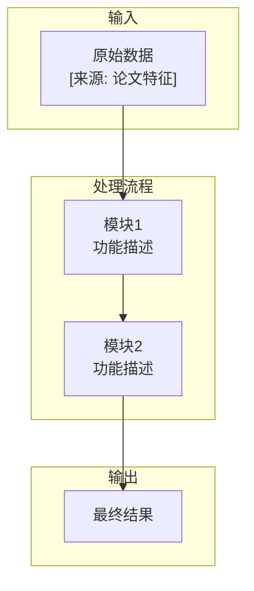

# 论文分析报告输出格式指南

# 1. 五段式结构写作指南

## 1.1 一句话总结

用 1-2 句话概括论文核心贡献。**必须包含**：核心问题 + 提出方法 + 关键结果。

**格式要求：**
- 关键术语和核心数字用 `==高亮==`（如 `==SOTA==`、`==28.4 BLEU==`、`==3 倍==`）
- 多个贡献时选最重要的 1-2 个

**示例：**
> 本文提出了 Transformer 架构，完全基于注意力机制摒弃了 RNN 和 CNN，在 ==WMT 2014 英德翻译== 任务上取得了 ==28.4 BLEU== 的 SOTA 结果，训练速度比主流模型提升 ==3 倍以上== 。

## 1.2 论文基本信息

```markdown
| 属性 | 内容 |
|------|------|
| **论文标题** | ... |
| **作者** | ... |
| **机构** | ... |
| **arXiv ID** | ... |
| **发表日期** | ... |
| **论文类型** | 实验类/理论类/综述类/系统类 |
| **核心方法** | ... |
| **基线模型** | ... |
| **开源代码** | ... |
| **评估数据集** | ... |

> [!info] 论文定位
> 本文属于 ==领域A== 与 ==领域B== 的交叉领域，聚焦于解决...问题。
```

信息不完整时标注 `[待补充]`，不要臆造。

## 1.3 核心内容详解（四小节）

根据论文类型调整各小节标题：

| 论文类型 | ①背景小节 | ②方法小节 | ③实验小节 | ④展望小节 |
|----------|-----------|-----------|-----------|-----------|
| **实验类** | 研究背景与问题 | 方法方案 | 实验/结果 | 改进空间与展望 |
| **综述类** | 研究领域概览 | 分类与对比 | 关键发现与趋势 | 开放问题与展望 |
| **理论类** | 理论动机 | 理论框架 | 理论结果 | 局限与拓展 |
| **系统类** | 需求与挑战 | 系统架构 | 性能基准 | 改进方向 |

### ① 研究背景与问题

**目标：** 让读者理解为什么这个问题重要、为什么现有方法不够。

**必须涵盖：**
- 领域背景与基础概念定义（对不熟悉者要解释术语）
- 现有主流方法及基本思路
- 现有方法的具体局限（作者指出的技术挑战）
- 问题的重要性（学术/应用价值）
- 本文动机（作者为什么认为他们的方案能解决问题）

> 假设读者可能不熟悉该领域。对于关键概念，先用通俗语言解释（直观类比），再用学术术语准确描述。

### ② 方法方案

**目标：** 讲清楚方法如何工作、每一步为什么这样设计。

**必须涵盖：**
- **核心思想**：一句话概括方法基本思路
- **整体架构**：输入→处理→输出流程
- **关键技术细节**（每个组件）：输入输出、内部机制、设计动机、与现有方法的区别
- **训练/推理流程**（实验类）：损失函数、训练策略、推理过程
- **与现有方法的关键区别**

> - **逐层深入**：先整体框架，再逐层展开细节。每个技术点解释"为什么这样设计"
> - **对比说明**：用对比方式呈现创新点
> - **公式处理**：说明每个符号含义、公式的直观含义、与系统组件的对应关系
> - **可视化描述**：即使论文没有图，也要用文字描述方法结构
> - **背景概念解释**：注意力机制、残差连接等子技术对初学者简要解释

### ③ 实验效果

**目标：** 回答实验证明了什么、结果有多好、为什么好。

**必须涵盖：**
- **实验设置**：数据集（规模/来源/特点）、评价指标（选择原因）、Baseline、环境
- **主要结果**：主实验结果 + 具体数据 + 核心发现
- **消融实验**：验证的设计选择、各组件贡献度、关键参数影响
- **可视化分析**：注意力图、特征可视化等及其揭示的信息
- **结果解读**：为什么在这些数据集/指标上表现好/不好？对领域的启示？

> 数据要全面，`==高亮==` 重要数值。对每个结果给出解读，不要仅罗列数字。如有错误分析、鲁棒性测试等，重点讨论。

### ④ 改进空间与展望

**目标：** 客观评价局限与合理改进方向。

**必须涵盖：**
- **局限性**（有依据）：理论局限（如假设过强）、实验局限（如数据集单一）、应用局限（如计算成本高）
- **改进方向**（具体可行）：直接扩展（其他领域/任务）、方法改进（解决具体缺陷）、理论深化
- **开放问题**：论文遗留的未解决问题

> 保持客观中立。在表述上清晰区分事实（如使用“作者指出”）与合理推论（如使用“可能暗示”）。

## 1.4 流程图详解

**每个流程图必须附带逐步说明**，解释每个节点的含义和关键步骤。

**Mermaid 模板：**



**逐步说明示例：**
> 1. **原始数据**流入模块1：具体来说，输入是...
> 2. **模块1**处理后输出...：关键操作是...
> 3. **模块2**接收并进一步处理...：创新点在于...
> 4. **最终结果**为...：核心输出...

**节点换行规则：** 必须使用 `<br/>`，不要使用 `\n`。示例：`A["第一行<br/>第二行"]`。

**降级原则：**
1. 无法绘制完整流程图时，先尝试简化的高层流程图
2. 高层流程图也无法保证准确时，说明无法绘制的原因
3. **不要臆测训练/推理/处理流程中没有明确说明的步骤**

## 1.5 总结

```markdown
> [!abstract] 论文总结
>
> 核心贡献总结... 
>
> 实验/理论结果关键数据... 
>
> 对该领域的意义或实际应用价值...
```

简洁有力，突出最重要的贡献和数据。

---

# 2. 格式元素规范

| 元素 | 格式 | 用途 |
|------|------|------|
| **高亮** | `==text==` | 关键词、核心术语、重要数字（SOTA 数值、百分比提升等） |
| **加粗** | `**text**` | 强调但不至高亮级别 |
| **信息 callout** | `> [!info]` | 论文定位、背景知识 |
| **警告 callout** | `> [!warning]` | 局限性、研究空白、待改进 |
| **成功 callout** | `> [!success]` | 关键发现、核心结果 |
| **笔记 callout** | `> [!note]` | 补充信息、方法对比、模型列表 |
| **提示 callout** | `> [!tip]` | 方法优势、实用技巧 |
| **重要 callout** | `> [!important]` | 关键公式、核心机制 |
| **摘要 callout** | `> [!abstract]` | 最终总结 |
| **mermaid 流程图** | ` ```mermaid` | 方法流程可视化 |

---

# 3. 增强讲解策略（完整版）

使讲解更加详尽的五项策略：

## 策略一：层级化解释

对每个技术概念，采用三层递进式解释：

1. **一句话定义** — 最简洁的语言说明"是什么"
2. **直观类比** — 日常生活或熟悉领域的类比帮助理解
3. **技术细节** — 准确的技术描述（公式、架构图、算法步骤）

**示例（自注意力机制）：**
> **自注意力机制**是一种让序列中每个位置都能关注所有其他位置的计算机制。可以想象成模型在阅读句子中的每个词时，会同时查看句中所有其他词来理解上下文，而不是像 RNN 那样逐个词阅读。具体来说，自注意力计算 query-key 点积得到注意力权重...

## 策略二：多视角分析

对关键贡献从多个角度阐述：
- **理论视角** — 方法的理论基础和数学涵义
- **实践视角** — 工程实现中的考虑
- **对比视角** — 与现有方法有何不同、为什么更好
- **直觉视角** — 作者为什么选择此方案，直觉动机是什么

## 策略三：结构化对比

用多维对比表展示创新定位：

```markdown
| 维度 | 本文方法 | 现有方法 A | 现有方法 B |
|------|---------|-----------|-----------|
| 核心思路 | ... | ... | ... |
| 计算复杂度 | ... | ... | ... |
| 适用场景 | ... | ... | ... |
| 关键局限 | ... | ... | ... |
```

## 策略四：关键公式/算法详细解读

1. **定位** — 说明该公式/算法在方法中的位置和目的
2. **逐项解释** — 解释每个符号的含义
3. **自然语言翻译** — 用自然语言"翻译"数学表述
4. **推导直觉** — 说明公式的推导直觉（不复杂时）

## 策略五：实验结果的深层解读

不只是汇报数字：
- **为什么好/不好？** — 在特定数据集上表现好/差的原因
- **误差分析** — 方法在哪些困难场景下失败
- **计算代价** — 训练/推理效率如何
- **鲁棒性** — 对超参数、初始化等的敏感性

---

# 4. 写作原则

- **深入而非宽泛**：每个技术点回答"为什么"和"怎么做"。先讲核心思想→架构→细节。不熟悉的技术提供背景介绍
- **流程结构可视化**：所有涉及流程、架构、结构的内容必须使用 Mermaid 绘制流程图，不可仅用纯文本
- **事实优先**：关键结论有据可查，避免凭空补全与臆造
- **客观中立**：在表述上清晰区分事实与合理推论/待核实信息，避免使用括号标签
- **语言**：跟随用户语言；专业术语保留原文并附注释；`==高亮==` 标记关键术语和数字，`**加粗**` 做一般强调
