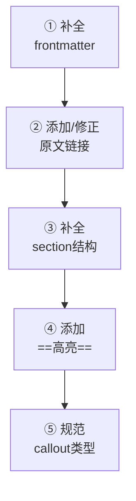

# 论文笔记格式标准化指南

供 Phase 5（格式标准化与归档）使用。SKILL.md 中概述了工作流，本文档提供完整操作模式、标签映射和注意事项。

# 1. 操作模式

### 模式 A：添加原文 PDF 链接

在 frontmatter 的 `---` 之后、正文第一行之前插入：

```markdown
**原文**: [本地](论文/论文原件/文件名.pdf) [网络](https://arxiv.org/abs/XXXX.XXXXX)
```

**查找 arXiv 链接：** 优先在笔记正文中搜索 `arxiv.org`，没有则使用 `tavily-search-mcp` 搜索论文 arXiv 编号。

### 模式 B：标签层级重构（扁平 → paper/xxx）

| 旧标签 | 新标签 |
|--------|--------|
| `VLM` | `paper/vlm` |
| `LoRA` | `paper/lora` |
| `NAS` | `paper/nas` |
| `transformer` | `paper/transformer` |
| `localization` | `paper/localization` |
| `detection` | `paper/detection` |
| `segmentation` | `paper/segmentation` |
| `LLM` | `paper/llm` |
| `diffusion` | `paper/diffusion` |
| `multi-modal` | `paper/multi-modal` |
| `3D` | `paper/3d` |

> 首字母大小写均可，根据用户现有风格保持一致。层级标签在 Obsidian 中可作为可点击筛选项。

### 模式 C：标准化文档结构

将笔记调整为标准格式框架：



1. **补全 frontmatter** — 确保 `title`、`date`、`tags`（paper/xxx）、`aliases` 完整
2. **添加/修正原文链接行** — 统一格式 `**原文**: [本地](path) [网络](url)`
3. **补全 section 结构**：
   - `# 一句话总结` — 若缺，从摘要提取核心贡献
   - `# 论文基本信息` — 若缺，从正文提取元数据填入标准表格
   - `> [!info] 论文定位` callout — 定位论文所属领域
   - `# 核心内容详解` — 按 h2/h3 层级组织
   - `# 流程图详解` — 根据方法绘制 Mermaid 流程图（适用时）
   - `# 总结` — abstract callout 汇总
4. **添加 `==高亮==`** — 标记关键术语和核心数字
5. **规范 callout 类型** — 使用标准 callout

### 模式 D：清理 frontmatter 冗余属性

检测并移除 `original_pdf`、`arxiv`、`pdf`、`category` 等冗余字段：

```yaml
# 删除这一行
original_pdf: 论文/论文原件/XXX.pdf
```

---

# 2. 映射规则

根据文件名模式自动匹配 MD 与 PDF：

| MD 文件 | 对应 PDF |
|---------|---------|
| `AI分析/MLP-Memory.md` | `论文原件/MLP-Memory.pdf` |
| `AI分析/VLM-Loc.md` | `论文原件/VLM-Loc.pdf` |
| `分析/xxx.md` | `论文原件/xxx.pdf` |

匹配逻辑：MD 文件名（不含路径）与 PDF 文件名匹配。建议统一使用基于标题的简短命名（如 `MLP-Memory.md` ↔ `MLP-Memory.pdf`），提取论文标题中的核心关键词，简洁直观。不匹配时先向用户确认映射关系。

---

# 3. 常见注意事项

- PDF 路径使用相对路径（相对于 vault 根目录）：`论文/论文原件/文件名.pdf`
- 无对应 PDF 的笔记不添加 `[本地]` 链接，或只添加 `[网络]` 链接
- 同一 PDF 对应多个 MD 文件时，每个文件都添加相同链接
- `**原文**:` 行插入在 frontmatter 之后、正文第一行之前
- 不修改正文中的图片引用（`![[图片.png]]` 等）
- 修改 section 结构时仅添加缺失的标题和框架，不重写用户已有内容
- 保持用户原有的分析和评论不变

---

# 4. 标准 callout 使用指南

> 完整 callout 规范见 `analysis-guide.md` §2，本表仅列出 tidy 阶段最常用类型。

| Callout 类型 | 适用场景 | 示例标题 |
|-------------|----------|---------|
| `> [!info]` | 论文定位、背景知识 | `论文定位` |
| `> [!warning]` | 局限性、研究空白、待改进 | `研究空白`、`待改进之处`、`局限性` |
| `> [!success]` | 关键发现、核心结果 | `关键发现`、`核心结果` |
| `> [!note]` | 补充信息、模型列表、优势 | `代表性 VLM 模型`、`四大核心优势` |
| `> [!tip]` | 方法优势、实用技巧 | `优势` |
| `> [!important]` | 关键公式、核心机制 | `关键公式` |
| `> [!abstract]` | 最终总结 | `论文总结` |

---

# 5. 校验方式

编辑后使用 grep 确认：
1. 旧值已消失：搜索旧标签/属性值
2. 新值已出现：搜索新标签、`原文` 链接行、标准 section 标题

对每个检查报告通过/失败。

---

# 6. 汇总报告示例

```
| 目录 | 文件数 | 变更类型 | 状态 |
|------|--------|---------|------|
| 论文/AI分析/ | 10 | 添加原文链接 + 整理标签 | 通过 |
| 论文/分析/ | 5 | 标准化文档结构 | 通过 |
```
